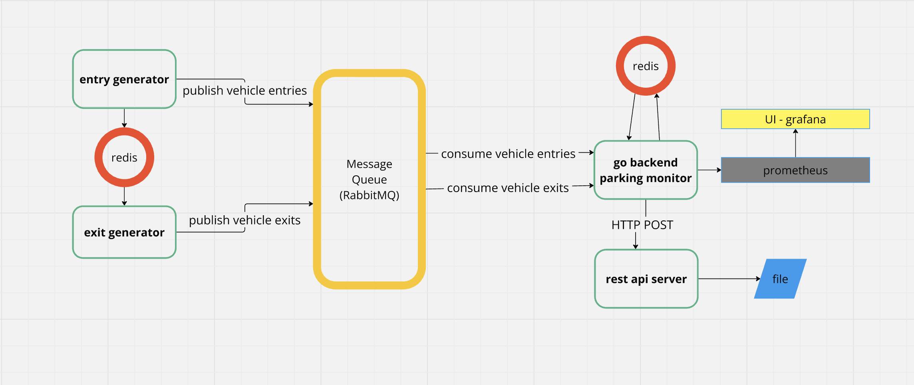

<!-- todo

api docs
prometheus meyrics

retention rabbit mq

docker exec -it rabbitmq rabbitmqctl set_policy TTL ".*" '{"message-ttl":60000}' --apply-to queues -->


# Parking Monitor / Duration Calculator

## System Diagram


---
## to set up and run services: 
- prerequisites: docker, docker-compose , python3 , go
versions used in development: docker  27.2.0, docker-compose version v2.11.2, python3 version 3.12.5, go 1.23.1
```
docker-compose up
```
- this shall bring up entry generator service, exit generator service, rabbitmq, redis, go backend service, python fastapi server, prometheus and grafana
- all configuration are managed through docker-compose environment variables and config files in /platform_config

Once the containers are up and running

1. api server documentation at http://localhost:8000/docs

2. dashboard for metrics event processing latency and event processing fail/success count http://localhost:3000/d/parking-metrics/parking-metrics?orgId=1


## to run unit tests 
(tests made to cover core logic; coverage to be improved)

1. go backend
```
cd services/go_services
go test -v ./...  
```

2. api server
```
cd services/api-server
python -m venv .venv
source .venv/bin/activate
pip install -r requirements.txt
pytest
```

## notes:

- focus has been on implementing processing logic and automating setup right up to dashboard.
- sensitive config information need to be handled better in future version, right now they are seen in config files and are default values provided in container image docs.
- unit tests have been written only to cover core processing logic in the go backend and python rest api code. 
- instrumentation for prometheus metrics collection has only been done in the go backend service


